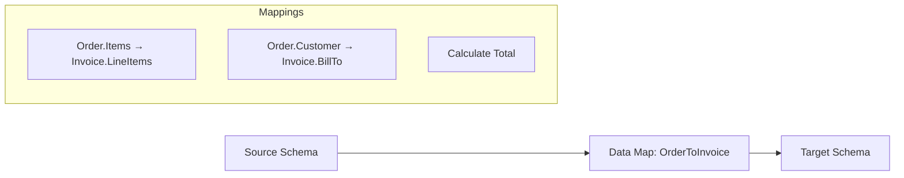

````prompt
---
name: dm-unit-tests-discover
description: Discover Logic Apps Standard data map definitions in the repo, analyze source/target schemas, and produce a testability inventory for unit test generation.
---

## Responsibilities
- Locate data map definition files (`.lml` files in `Artifacts/MapDefinitions/`).
- Locate existing XSLT files (`.xslt` files in `Artifacts/Maps/`).
- For each data map:
  - Identify source and target schema types (XML/JSON).
  - Analyze the mapping structure and transformation rules.
  - Extract field mappings and transformation functions used.
  - Identify any custom functions or complex transformations.
- Output a data map inventory report for downstream skills.

## Diagram Format
Example transformation flow:


## Data Map Location
Data maps in Logic Apps Standard projects are stored in:
```
<LogicAppsProject>/
├── Artifacts/
│   ├── MapDefinitions/     # LML map definition files
│   │   └── <MapName>.lml
│   ├── Maps/               # Compiled XSLT files
│   │   └── <MapName>.xslt
│   └── Schemas/            # Source and target schemas (XSD/JSON)
│       ├── <SourceSchema>.xsd
│       └── <TargetSchema>.xsd
```

## LML Map Structure
LML (Logic Apps Markup Language) maps typically contain:
- Source schema reference
- Target schema reference
- Direct field mappings
- Transformation functions (string manipulation, math, date/time)
- Conditional mappings
- Loops for repeating elements
- Custom expressions

## Schema Inference
When analyzing a data map:
1. First, check if the LML file references schema files
2. Look for schema files in `Artifacts/Schemas/`
3. Analyze sample mappings to infer structure
4. If schemas cannot be determined:
   - List the fields referenced in mappings
   - Request schema references from the user

## Transformation Types to Identify
| Transformation Type | Description | Test Consideration |
|---------------------|-------------|-------------------|
| Direct mapping | Field to field copy | Verify value preservation |
| Concatenation | Combine multiple fields | Test all source fields |
| Substring | Extract portion of text | Test boundary cases |
| Conditional | If/else mapping | Test all branches |
| Loop | Repeating element mapping | Test 0, 1, many items |
| Math operations | Calculations | Test edge cases, precision |
| Date/time | Format conversions | Test various formats |
| Lookup | Reference data mapping | Test found/not found |
| Default values | Fallback when source empty | Test empty source |
| Custom functions | User-defined logic | Test expected behavior |

## Output
- List of data maps found (name + file path)
- Per data map:
  - Source schema: type, structure (if inferrable)
  - Target schema: type, structure (if inferrable)
  - Mapping summary: field mappings count
  - Transformations: list of transformation types used
  - Complexity: simple/moderate/complex
- Schema inventory: list of schema files found
- Missing schemas: list of schemas that need to be provided

## Sample Discovery Output
```markdown
# Data Map Discovery Report

## Maps Found
| Map Name | LML Path | XSLT Exists | Source Schema | Target Schema |
|----------|----------|-------------|---------------|---------------|
| OrderToInvoice | Artifacts/MapDefinitions/OrderToInvoice.lml | Yes | Order.xsd | Invoice.xsd |
| CustomerSync | Artifacts/MapDefinitions/CustomerSync.lml | No | (infer from map) | (infer from map) |

## OrderToInvoice Map Details
- **Source Schema**: Order.xsd (XML)
- **Target Schema**: Invoice.xsd (XML)
- **Mappings**: 15 field mappings
- **Transformations Used**:
  - Direct mappings: 10
  - Concatenation: 2
  - Date formatting: 2
  - Calculated field: 1
- **Complexity**: Moderate

## Schema Files Found
- Artifacts/Schemas/Order.xsd
- Artifacts/Schemas/Invoice.xsd

## Action Required
- CustomerSync map: Schema files not found. Please provide:
  - Source schema definition or sample
  - Target schema definition or sample
```

````
