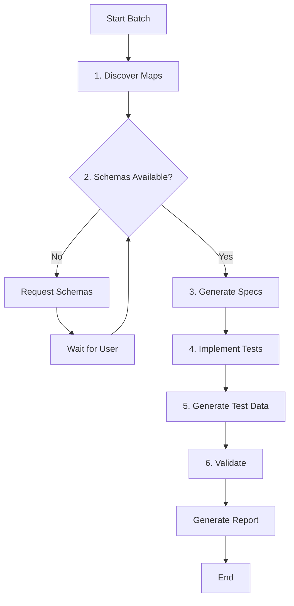

````prompt
---
name: dm-unit-tests-project-batch
description: Execute project-wide data map unit test generation tasks (cases, implementation, test data) across all data maps in a Logic Apps Standard project.
---

## Responsibilities
- Use the discovery skill to enumerate data maps first.
- Apply the requested operation consistently per data map.
- Produce a roll-up report of changes per map.

## Pre-Execution Checklist
**AGENT MUST verify these conditions before starting batch operations:**

1. ✅ **Data Maps Exist**: Confirm `.lml` files in `Artifacts/MapDefinitions/` and/or `.xslt` files in `Artifacts/Maps/`
2. ✅ **Test Project Exists**: Check if `Tests/DataMaps/DataMaps.Tests.csproj` exists
3. ✅ **Solution Exists**: If no test project, check if `Tests/Tests.sln` exists for scaffolding

**Note:** LML maps and XSLT maps with the same name should share the same test folder (e.g., `Tests/DataMaps/OrderToInvoice/`).

### Decision Tree:
```
1. DISCOVER all data maps first (both .lml and .xslt)
   - Consolidate maps with same name (LML + XSLT → single test folder)

2. CHECK: Does Tests/DataMaps/DataMaps.Tests.csproj exist?
   
   ✅ YES → Continue to step 3
   
   ❌ NO → CHECK: Does Tests/Tests.sln exist?
      
      ✅ Tests.sln exists → SCAFFOLD the DataMaps test project:
         - Create Tests/DataMaps/ folder
         - Create DataMaps.Tests.csproj with required PackageReferences
         - Create DataMapTestExecutorFactory.cs
         - Add project to Tests.sln
         - Continue to step 3
         
      ❌ Tests.sln does not exist → STOP and inform user:
         "No test solution found. Please create Tests/Tests.sln first 
          or run 'Create Unit Test' from a Logic Apps workflow to 
          initialize the test project structure."

3. FOR EACH data map, CHECK: Does Tests/DataMaps/<map-name>/ exist?
   
   ✅ YES → Map is ready for test implementation
   
   ❌ NO → CREATE the map test folder structure:
      - Tests/DataMaps/<map-name>/
      - Tests/DataMaps/<map-name>/testSettings.config
      - Tests/DataMaps/<map-name>/TestData/Input/
      - Tests/DataMaps/<map-name>/TestData/Expected/

4. PROCEED with batch operations for all maps
```

### Scaffolding Actions (Agent CAN perform):

**When Tests.sln exists but DataMaps.Tests.csproj does not:**
```powershell
# Create folder and project
mkdir Tests/DataMaps
# Create DataMaps.Tests.csproj (use template from implementation skill)
# Create DataMapTestExecutorFactory.cs (use template from implementation skill)
dotnet sln Tests/Tests.sln add Tests/DataMaps/DataMaps.Tests.csproj
```

**For each map without a test folder:**
- Create `Tests/DataMaps/<map-name>/`
- Create `testSettings.config` from template
- Create `TestData/Input/` and `TestData/Expected/` folders

### Map Folder Naming Convention:
- Use the map name without extension as the folder name
- LML and XSLT maps with the same name share the same test folder
- Example: Both `OrderToInvoice.lml` and `OrderToInvoice.xslt` → `Tests/DataMaps/OrderToInvoice/`

## Project Structure
```
<workspace>/
├── <LogicAppsProject>/              # Logic Apps Standard project
│   ├── host.json
│   ├── connections.json
│   ├── local.settings.json
│   └── Artifacts/
│       ├── MapDefinitions/          # LML map definition files
│       │   ├── OrderToInvoice.lml
│       │   └── CustomerSync.lml
│       ├── Maps/                    # Compiled XSLT files
│       │   └── OrderToInvoice.xslt
│       └── Schemas/                 # Source and target schemas
│           ├── Order.xsd
│           └── Invoice.xsd
├── plan/                            # Test specifications (at workspace root)
│   ├── OrderToInvoice-testplan.md
│   └── CustomerSync-testplan.md
└── Tests/                           # Unit test project
    ├── Tests.sln
    └── DataMaps/
        ├── DataMaps.Tests.csproj
        ├── DataMapTestExecutorFactory.cs
        ├── OrderToInvoice/
        │   ├── testSettings.config
        │   ├── OrderToInvoiceTests.cs
        │   └── TestData/
        │       ├── Input/
        │       │   └── TC01_ValidOrder.xml
        │       └── Expected/
        │           └── TC01_ValidOrder_Expected.json
        └── CustomerSync/
            ├── testSettings.config
            ├── CustomerSyncTests.cs
            └── TestData/
                ├── Input/
                └── Expected/
```

## Batch Operation Workflow

### 0. Workspace Setup
- Ensure `plan/` folder exists at workspace root
- Ensure `Tests/` folder exists at workspace root
- If folders are not already in the VS Code workspace, add them using:
  - `code --add <workspace>/plan`
  - `code --add <workspace>/Tests`
- This ensures test specs and test code are visible and accessible in the IDE

### 1. Discovery Phase
- Scan for `.lml` files in `Artifacts/MapDefinitions/`
- Check for existing `.xslt` files in `Artifacts/Maps/`
- Build data map inventory with:
  - Map name
  - Source/target schema info (if available)
  - Transformation complexity
- Identify schema requirements

### 2. Schema Resolution Phase
For each data map:
- Check if source/target schemas are available in `Artifacts/Schemas/`
- If schemas not found:
  - Attempt to infer structure from map definition
  - List required schemas for user to provide
  - **STOP** and request missing schemas before proceeding

### 3. Spec Generation Phase (per map)
- Create/update `<workspace>/plan/<map-name>-testplan.md`
- Define test case catalog:
  - Happy path transformation
  - Edge cases (empty, missing fields, etc.)
  - Boundary value tests
  - Special character handling
- Document expected mappings

### 4. Implementation Phase (per map)
- Create `Tests/DataMaps/<map-name>/` structure
- Generate `testSettings.config`
- Generate test class file
- Generate test data folder structure

### 5. Test Data Generation Phase (per map)
- Create input data files in `TestData/Input/`
- Create expected output files in `TestData/Expected/`
- Cover all test cases in the spec

### 6. Validation Phase
- Run `dotnet build` on Tests project
- Run `dotnet test` to verify all tests pass
- Report any failures

## testSettings.config Template
```xml
<?xml version="1.0" encoding="utf-8"?>
<TestSettings>
  <WorkspacePath>../../../..</WorkspacePath>
  <LogicAppName><LogicAppsProjectName></LogicAppName>
  <MapName><map-name></MapName>
</TestSettings>
```

## Handling Missing Schemas

When schemas cannot be inferred:

```markdown
## Schema Resolution Required

The following data maps require schema information:

| Map Name | Missing Schema | Type |
|----------|----------------|------|
| CustomerSync | Source | XSD or sample XML |
| CustomerSync | Target | XSD or sample XML |

### Options to Resolve:
1. **Provide schema files** - Place XSD files in `Artifacts/Schemas/`
2. **Provide sample data** - Provide sample input/output XML or JSON
3. **Describe structure** - Describe the expected field structure

Please provide the missing information to continue.
```

## Output
- Summary table: map -> artifacts created/updated
- Any skipped maps + reason (e.g., missing schemas)
- Build/test results
- **When creating diagrams** to visualize batch progress or map relationships, use **Mermaid format**

### Summary Report Format
```markdown
# Data Map Unit Test Batch Report

## Overview
| Metric | Value |
|--------|-------|
| Maps Discovered | 5 |
| Specs Created | 4 |
| Test Classes Generated | 4 |
| Test Cases Total | 25 |
| Maps Skipped | 1 |

## Per-Map Status
| Map Name | Spec | Test Class | Test Data | Tests | Status |
|----------|------|------------|-----------|-------|--------|
| OrderToInvoice | Created | Generated | 6 files | 5 | ✅ Pass |
| CustomerSync | Created | Generated | 4 files | 4 | ✅ Pass |
| ProductTransform | Created | Generated | 8 files | 6 | ✅ Pass |
| LegacyFormat | Created | Generated | 4 files | 3 | ✅ Pass |
| NewFormat | Skipped | - | - | - | ⚠️ Missing Schema |

## Artifacts Created
```
plan/
├── OrderToInvoice-testplan.md
├── CustomerSync-testplan.md
├── ProductTransform-testplan.md
└── LegacyFormat-testplan.md

Tests/DataMaps/
├── DataMaps.Tests.csproj
├── DataMapTestExecutorFactory.cs
├── OrderToInvoice/
│   ├── testSettings.config
│   ├── OrderToInvoiceTests.cs
│   └── TestData/ (6 files)
├── CustomerSync/
│   └── ...
└── ...
```

## Action Required
- **NewFormat map**: Please provide source and target schema files

## Test Execution Results
```
dotnet test
Passed!  - Failed: 0, Passed: 18, Skipped: 0, Total: 18
```
```

## Batch Execution Diagram


````
