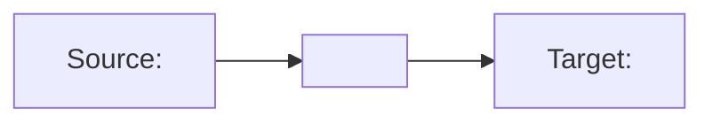

````prompt
---
name: dm-unit-tests-speckit-specs
description: Write and maintain Speckit-style specification documents for Data Map unit tests so scenarios remain reusable and consistent.
---

## Workspace Setup
- Ensure the `plan/` folder exists at the workspace root level
- If the `plan/` folder is not already added to the VS Code workspace, add it using: `code --add <workspace>/plan`

## Responsibilities
- For each data map, create or update a spec document that includes:
  - Map overview (source schema, target schema, purpose)
  - Mapping rules summary
  - Test case catalog
  - Per test case: intent, input data, expected results, validation criteria
- Keep specs stable as the reusable source, and treat code as implementation.
- Store specs in `<workspace>/plan/<map-name>-testplan.md` (at workspace root, not inside the Logic Apps project folder)
- **When creating diagrams** to visualize transformation flow or test scenarios, use **Mermaid format**

## Recommended Format

```markdown
# Unit Test Specification: <map-name>

## Map Overview
| Property | Value |
|----------|-------|
| Map Name | <map-name> |
| LML Path | Artifacts/MapDefinitions/<map-name>.lml |
| Source Schema | <source-schema> |
| Target Schema | <target-schema> |
| Source Format | XML / JSON |
| Target Format | XML / JSON |
| Purpose | Brief description of transformation |

## Transformation Flow


## Mapping Rules Summary
| Source Path | Target Path | Transformation | Notes |
|-------------|-------------|----------------|-------|
| /Order/OrderId | /Invoice/InvoiceNumber | Direct | Copy value |
| /Order/Customer/Name | /Invoice/BillTo/Name | Direct | Copy value |
| /Order/Items/Item | /Invoice/LineItems/LineItem | Loop | For each item |
| /Order/Items/Item/Qty | /Invoice/LineItems/LineItem/Quantity | Direct | Copy value |
| (calculated) | /Invoice/TotalAmount | Sum | Sum of line totals |

## Test Case Catalog
| ID | Name | Category | Input Type | Expected Status |
|----|------|----------|------------|-----------------|
| TC01 | ValidOrderTransformation | Happy Path | Complete order | Success |
| TC02 | EmptyLineItems | Edge Case | No items | Success |
| TC03 | MissingOptionalFields | Edge Case | Minimal input | Success |

---

## Test Cases

### TC01: Valid Order Transformation

**Intent**: Verify the data map correctly transforms a complete order with multiple line items into an invoice.

**Category**: Happy Path

**Input Data**:
```xml
<Order>
  <OrderId>ORD-001</OrderId>
  <OrderDate>2024-01-15</OrderDate>
  <Customer>
    <Name>Contoso Ltd</Name>
    <Address>123 Main St</Address>
  </Customer>
  <Items>
    <Item>
      <ProductId>PROD-A</ProductId>
      <Description>Widget A</Description>
      <Qty>5</Qty>
      <UnitPrice>10.00</UnitPrice>
    </Item>
    <Item>
      <ProductId>PROD-B</ProductId>
      <Description>Widget B</Description>
      <Qty>3</Qty>
      <UnitPrice>25.00</UnitPrice>
    </Item>
  </Items>
</Order>
```

**Expected Output**:
```xml
<Invoice>
  <InvoiceNumber>ORD-001</InvoiceNumber>
  <InvoiceDate>2024-01-15</InvoiceDate>
  <BillTo>
    <Name>Contoso Ltd</Name>
    <Address>123 Main St</Address>
  </BillTo>
  <LineItems>
    <LineItem>
      <ProductCode>PROD-A</ProductCode>
      <Description>Widget A</Description>
      <Quantity>5</Quantity>
      <Price>10.00</Price>
      <LineTotal>50.00</LineTotal>
    </LineItem>
    <LineItem>
      <ProductCode>PROD-B</ProductCode>
      <Description>Widget B</Description>
      <Quantity>3</Quantity>
      <Price>25.00</Price>
      <LineTotal>75.00</LineTotal>
    </LineItem>
  </LineItems>
  <TotalAmount>125.00</TotalAmount>
</Invoice>
```

**Validation Criteria**:
- [ ] InvoiceNumber equals OrderId
- [ ] InvoiceDate equals OrderDate
- [ ] BillTo/Name equals Customer/Name
- [ ] LineItems count equals Items count (2)
- [ ] Each LineItem/Quantity equals corresponding Item/Qty
- [ ] Each LineItem/LineTotal equals Qty × UnitPrice
- [ ] TotalAmount equals sum of LineTotals (125.00)

---

### TC02: Empty Line Items

**Intent**: Verify the data map handles an order with no line items.

**Category**: Edge Case

**Input Data**:
```xml
<Order>
  <OrderId>ORD-002</OrderId>
  <OrderDate>2024-01-16</OrderDate>
  <Customer>
    <Name>Empty Order Corp</Name>
  </Customer>
  <Items/>
</Order>
```

**Expected Output**:
```xml
<Invoice>
  <InvoiceNumber>ORD-002</InvoiceNumber>
  <InvoiceDate>2024-01-16</InvoiceDate>
  <BillTo>
    <Name>Empty Order Corp</Name>
  </BillTo>
  <LineItems/>
  <TotalAmount>0.00</TotalAmount>
</Invoice>
```

**Validation Criteria**:
- [ ] LineItems is empty
- [ ] TotalAmount is 0.00 or 0
- [ ] No errors thrown

---

### TC<##>: <Scenario Name>

**Intent**: <What this test validates>

**Category**: <Happy Path / Edge Case / Error Case>

**Input Data**:
```xml
<!-- Sample input -->
```

**Expected Output**:
```xml
<!-- Expected output -->
```

**Validation Criteria**:
- [ ] <Specific assertion>
- [ ] <Specific assertion>
```

## SDK Reference for Specs
- DataMapTestExecutor: Main class for running data map tests
- GenerateXslt: Compiles LML to XSLT
- RunMapAsync: Executes transformation
- Input: byte[] (UTF-8 encoded XML/JSON)
- Output: JToken (parsed result)

## Test Data Location
- Input samples: `Tests/DataMaps/<map-name>/TestData/Input/`
- Expected outputs: `Tests/DataMaps/<map-name>/TestData/Expected/`

````
