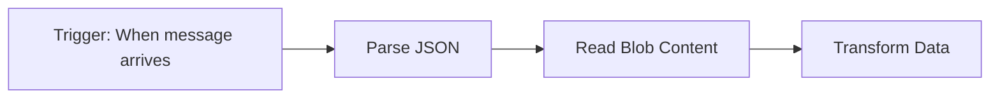

## Responsibilities
- Locate Logic Apps Standard workflow definition files (e.g., `workflow.json`).
- For each workflow:
  - Summarize trigger type, actions, and major branches/loops.
  - Identify external dependency points that need mocking.
  - Extract exact action names from `workflow.json` (these become mock keys).
- Output a workflow inventory report for downstream skills.

## Workflow Diagram Format


## Workflow Definition Structure
Logic Apps Standard workflows are defined in `workflow.json` with this structure:
```json
{
  "definition": {
    "$schema": "...",
    "triggers": {
      "<trigger_name>": { "type": "...", "kind": "..." }
    },
    "actions": {
      "<action_name>": { "type": "...", "runAfter": {...} }
    }
  }
}
```

## Actions Requiring Mocks (external dependencies)
| Action Type | Connector | Requires Mock |
|-------------|-----------|---------------|
| `ServiceProvider` | Azure Blob, Service Bus, SQL, etc. | YES |
| `Http` | HTTP calls | YES |
| `ApiConnection` | Managed connectors | YES |
| `Compose` | Data transformation | NO (internal) |
| `InitializeVariable` | Variables | NO (internal) |
| `SetVariable` | Variables | NO (internal) |
| `Response` | HTTP response | NO (internal) |
| `If`, `Switch`, `ForEach`, `Until` | Control flow | NO (internal) |

## Output
- List of workflows found (name + file path)
- Per-workflow:
  - Trigger: name, type, kind
  - Actions table: name, type, requires mock (yes/no)
  - Control flow: branches, loops, conditions
  - `runAfter` dependencies (execution order)
- Mock inventory: list of actions requiring mocks with exact names
