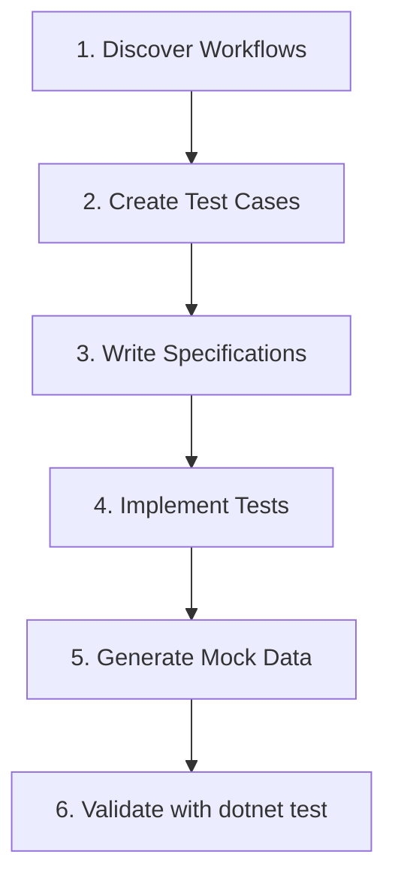

# Logic Apps Standard Unit Test Authoring Agent

An AI-powered agent system for authoring unit tests for Azure Logic Apps Standard workflows using the Automated Test Framework SDK.

## Overview

This agent helps developers accelerate unit test creation for Logic Apps Standard workflows by:
- Discovering workflow definitions and analyzing testability
- Creating comprehensive test specifications
- Implementing MSTest test cases with proper mocks
- Generating typed mock data classes
- Supporting both single-workflow and batch operations

## Installing the Custom Agent 

To integrate this agent into your Logic Apps Standard project:

### 1. Create the Agent Structure

**Important**: The `.github/` folder must be placed **inside your Logic Apps project directory**, not at the workspace root.

```
<workspace>/                           # VS Code workspace root
└── <LogicAppsProject>/                # Your Logic Apps project folder
    ├── .github/
    │   ├── agents/
    │   │   └── Logic Apps Unit Test Author.agent.md
    │   └── prompts/
    │       ├── la-unit-tests-discover.prompt.md
    │       ├── la-unit-tests-create-cases.prompt.md
    │       ├── la-unit-tests-speckit-specs.prompt.md
    │       ├── la-unit-tests-implement.prompt.md
    │       ├── la-unit-tests-generate-test-data.prompt.md
    │       └── la-unit-tests-project-batch.prompt.md
    ├── host.json
    ├── connections.json
    ├── local.settings.json
    └── <workflow-name>/
        └── workflow.json
```

### 2. Copy Agent Files

Copy all agent and prompt files from this repository's `.github/` folder into your Logic Apps project:

```bash
cd <path-to-your-logicapps-project>
mkdir -p .github/agents .github/prompts
# Copy files from this repository
```

Files to copy:
- **Agent definition**: `.github/agents/Logic Apps Unit Test Author.agent.md`
- **All prompt files**: `.github/prompts/*.prompt.md`

### 3. Verify GitHub Copilot Access

Ensure you have:
- **GitHub Copilot Chat** extension installed in VS Code
- **Logic Apps project folder** opened in VS Code (containing the `.github/` folder)
- **.github folder** is inside the Logic Apps project directory

### 4. Start Using the Agent

Once installed, invoke the agent in GitHub Copilot Chat:

```plaintext
@Logic Apps Unit Test Author discover workflows
```

Or reference specific skills directly:

```plaintext
#file:.github/prompts/la-unit-tests-discover.prompt.md
```

The agent will automatically understand your Logic Apps project structure and guide you through test creation.

### Prerequisites

Before using the agent, ensure:
- A Logic Apps Standard project with `workflow.json` files
- .NET 8.0 SDK installed (for test execution)
- VS Code opened at the Logic Apps project level (or workspace containing it)

## Getting Started

1. **Open the Logic Apps workspace** in VS Code
2. **Ensure .github folder** contains the agent and prompt files
3. **Invoke the agent** using GitHub Copilot Chat
4. **Let the agent guide you** through discovery → specs → implementation
5. **Reference a skill**: If you want to use a specific skill directly, you can invoke that skill by using `\<skill name>` at the prompt. The agent was defined in a way that it will use the most relevant skill for a particular job.

## Agent Activation

The agent automatically loads when working in a Logic Apps Standard workspace with unit tests. To explicitly reference:

```plaintext
@Logic Apps Unit Test Author discover workflows
@Logic Apps Unit Test Author create test cases for la-process-message
@Logic Apps Unit Test Author implement tests for all workflows
```

## Architecture

The agent uses a **prompt-based skill system** where specialized prompts handle different aspects of test authoring:

```
.github/
├── agents/
│   └── Logic Apps Unit Test Author.agent.md    # Main agent definition
└── prompts/                                      # Specialized skills
    ├── la-unit-tests-discover.prompt.md
    ├── la-unit-tests-create-cases.prompt.md
    ├── la-unit-tests-speckit-specs.prompt.md
    ├── la-unit-tests-implement.prompt.md
    ├── la-unit-tests-generate-test-data.prompt.md
    └── la-unit-tests-project-batch.prompt.md
```

## Technical Stack

- **Target Framework**: .NET 8.0 (`net8.0`)
- **Test Framework**: MSTest
- **SDK**: `Microsoft.Azure.Workflows.WebJobs.Tests.Extension` version `1.*`
- **Test Project Location**: `Tests/LogicApps/`
- **Specs Location**: `plan/<workflow-name>-testplan.md`

## Available Skills (Prompts)

| Skill | Purpose | Prompt File |
|-------|---------|-------------|
| **Discover** | Find workflows and analyze testability | `la-unit-tests-discover.prompt.md` |
| **Create Cases** | Propose test scenarios for workflows | `la-unit-tests-create-cases.prompt.md` |
| **Write Specs** | Generate/update test specification docs | `la-unit-tests-speckit-specs.prompt.md` |
| **Implement** | Generate MSTest test classes and mocks | `la-unit-tests-implement.prompt.md` |
| **Generate Data** | Create typed mock output classes | `la-unit-tests-generate-test-data.prompt.md` |
| **Batch Operations** | Process all workflows in a project | `la-unit-tests-project-batch.prompt.md` |

## Workflow Pattern

The agent follows a **spec-first, implementation-second** approach:



### Step-by-Step Process

1. **Discovery Phase**
   - Scan for `workflow.json` files
   - Identify triggers, actions, and dependencies
   - Determine which actions require mocks

2. **Specification Phase**
   - Create `plan/<workflow-name>-testplan.md`
   - Define test case catalog (TC01, TC02, etc.)
   - Document mock plans and expected outcomes
   - **Specs are reusable and version-controlled**

3. **Implementation Phase**
   - Generate MSTest classes in `Tests/LogicApps/<workflow-name>/`
   - Create typed MockOutput classes
   - Implement test methods with proper assertions
   - Generate `testSettings.config` files

## Usage Examples

### Single Workflow Testing

```plaintext
User: "Create test cases for the la-process-message workflow"

Agent will:
1. Load la-unit-tests-discover.prompt.md
2. Analyze workflow.json for la-process-message
3. Load la-unit-tests-create-cases.prompt.md
4. Propose test scenarios (TC01, TC02, etc.)
5. Load la-unit-tests-speckit-specs.prompt.md
6. Create plan/la-process-message-testplan.md
```

### Batch Operations

```plaintext
User: "Implement tests for all workflows"

Agent will:
1. Load la-unit-tests-project-batch.prompt.md
2. Discover all workflows in the project
3. For each workflow:
   - Create test spec
   - Generate MockOutputs classes
   - Implement test cases
4. Run `dotnet build` and `dotnet test`
5. Report results per workflow
```

### Test Data Generation

```plaintext
User: "Generate mock data for TC01"

Agent will:
1. Load la-unit-tests-generate-test-data.prompt.md
2. Read the test spec for TC01
3. Create typed MockOutput classes
4. Generate trigger and action mock payloads
```

## Test Case Naming Convention

```plaintext
TC<##>_<BriefScenarioName>

Examples:
  TC01_SuccessfulEndToEndFlow
  TC02_VerifyBlobNameFormat
  TC03_BlobUploadFailure
  TC04_EmptyRequestBody
```

## Standard Test Categories

| Category | Description | Workflow Status |
|----------|-------------|-----------------|
| Happy Path | All actions succeed | Succeeded |
| Input Validation | Empty/invalid inputs | Succeeded or Failed |
| Action Failure | External dependency fails | Failed |
| Partial Failure | Some actions fail, others skip | Failed |
| Edge Cases | Large payloads, special characters | Succeeded |
| Data Verification | Verify transformations/outputs | Succeeded |

## Quality & Safety

- ✅ No secrets or real credentials in test data
- ✅ No modifications to production workflow definitions
- ✅ Use TODO placeholders for unknown schemas
- ✅ Keep diffs minimal and reviewable
- ✅ Specs are reusable source of truth
- ✅ Code is implementation derived from specs

## Documentation Links

- [Azure Logic Apps Testing Framework](https://learn.microsoft.com/en-us/azure/logic-apps/testing-framework/)
- [UnitTestExecutor Class](https://learn.microsoft.com/en-us/azure/logic-apps/testing-framework/unit-test-executor-class-definition)
- [ActionMock Class](https://learn.microsoft.com/en-us/azure/logic-apps/testing-framework/action-mock-class-definition)
- [TriggerMock Class](https://learn.microsoft.com/en-us/azure/logic-apps/testing-framework/trigger-mock-class-definition)

---

**Last Updated**: January 2026  
**Agent Version**: 1.0 (Prompt-based architecture)
